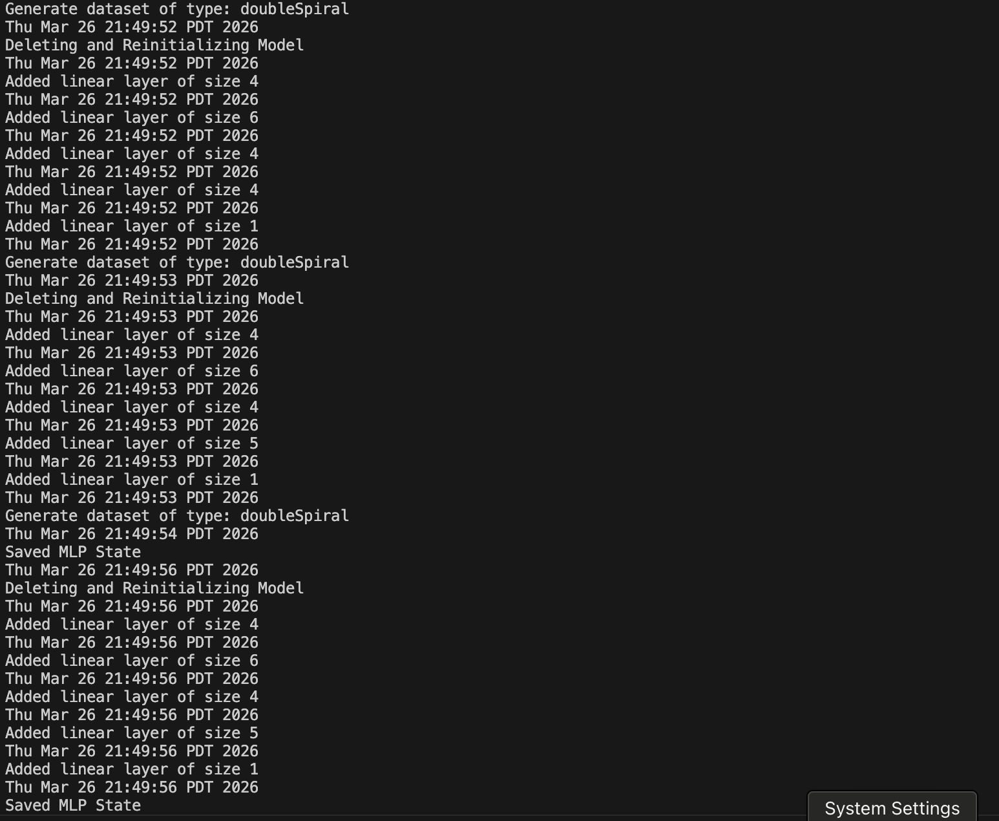

# My Personal Project

## Neural Net Playground

A Neural Network playground application where the user can add layers, activation functions, and customize their neural network to fit some data. (This will be similar to TensorFlow playground)

Features include:
* Specifying number of neurons per layer
* Adding however many layers to the network
* Choosing activation functions
* Visualizing how the model fits the data
* Graphs showing training/validation loss per epoch

## What will the application do?
This application will simulate how a neural network will fit/not fit to some data, allowing the user to customize their neural net to their liking. 
## Who will use it?
Anybody interest in machine learning or beginners getting into it.
## Why is this project of interest to you?
This project is of interest for me because I love machine learning and TensorFlow playground was a big inspiration for me when I first started.

## User stories
* As a user, I want to be able to add a new layer to my neural network and specify the number of neurons and the activation function.
* As a user, I want to be able to view a list of all layers currently in my model, showing their type, dimensions, and parameter counts.
* As a user, I want to be able to visualize the loss of the model as it trains.
* As a user, I want to be able to choose the dataset the model is going to train on.
* As a user, I want to be able to save model weights after it has trained
* As a user, I want to be able to load saved model weights

# Instructions for End User

-You can view the panel that displays the data points that have already been added to the model by looking at the VisPanel on the left side of the window, which renders the classification points as orange and blue circles.

-You can add layers to the network by clicking the "+ Layer" button in the center panel, which expands the layerSizes list and re-initializes the MLP.

-You can adjust the number of neurons in each layer by using the "+" and "-" buttons located under each specific "Hidden Layer" column to increase or decrease the neuron count for that specific layer.

-You can visualize the decision boundary as the model trains on your selected dataset on the left of the application.

-You can save the state of my application by clicking the "Save Model" button which triggers the JsonWriter to store the weights, biases, learning rate, and current dataset into a JSON file.

-You can reload the state of my application by clicking the "Load Model" button, which uses the JsonReader to reconstruct the network and automatically update the UI architecture labels and the current dataset to match the saved checkpoint.

# Phase 4: Task 3
I would refactor the PlaygroundUI class by moving the training function and data management into a separate Controller or Trainer class. Currently, PlaygroundUI handles too many things such managing the GUI components, training, and coordinating the MLP training states. By moving the trainStep and lossHistory functions into a dedicated TrainingManager class, I would achieve cleaner code. While this adds some complexity in how the classes work with eachother, it would make the code much more maintainable and allow the math logic to be tested independently of the graphical interface.